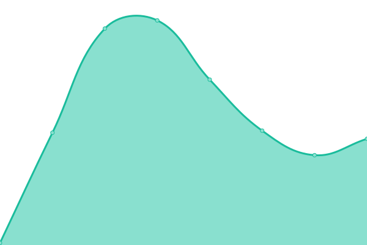
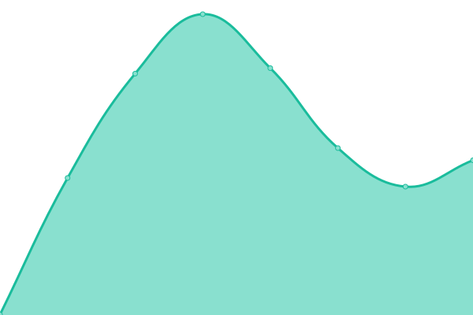
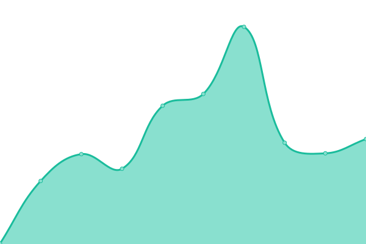
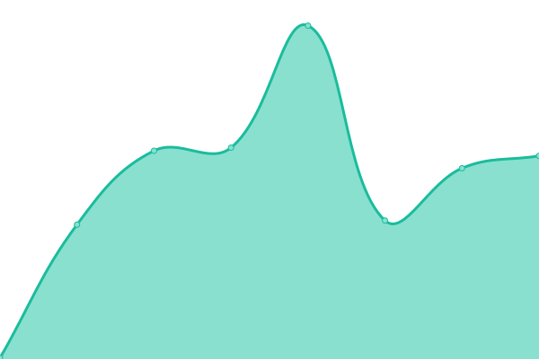
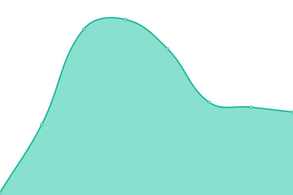

# [📈 Live Status](https://kemp.github.io/healthcheck): <!--live status--> **🟧 Partial outage**

This repository contains the open-source uptime monitor and status page for [Steven Kemp](https://www.kemp.app), powered by [Upptime](https://github.com/upptime/upptime).

With [Upptime](https://upptime.js.org), you can get your own unlimited and free uptime monitor and status page, powered entirely by a GitHub repository. We use [Issues](https://github.com/kemp/healthcheck/issues) as incident reports, [Actions](https://github.com/kemp/healthcheck/actions) as uptime monitors, and [Pages](https://kemp.github.io/healthcheck) for the status page.

<!--start: status pages-->
<!-- This summary is generated by Upptime (https://github.com/upptime/upptime) -->
<!-- Do not edit this manually, your changes will be overwritten -->
<!-- prettier-ignore -->
| URL | Status | History | Response Time | Uptime |
| --- | ------ | ------- | ------------- | ------ |
|  CamFlip API | 🟩 Up | [cam-flip-api.yml](https://github.com/kemp/healthcheck/commits/HEAD/history/cam-flip-api.yml) | 

 196ms
     
 | 

<a href="https://kemp.github.io/healthcheck/history/cam-flip-api">100.00%</a>
    

|  [CamFlip Home](https://camflip.net) | 🟩 Up | [cam-flip-home.yml](https://github.com/kemp/healthcheck/commits/HEAD/history/cam-flip-home.yml) | 

 65ms
     
 | 

<a href="https://kemp.github.io/healthcheck/history/cam-flip-home">100.00%</a>
    

|  CamFlip License | 🟩 Up | [cam-flip-license.yml](https://github.com/kemp/healthcheck/commits/HEAD/history/cam-flip-license.yml) | 

 74ms
     
 | 

<a href="https://kemp.github.io/healthcheck/history/cam-flip-license">100.00%</a>
    

|  [CamFlip Purchase Page](https://camflip.net/purchase) | 🟩 Up | [cam-flip-purchase-page.yml](https://github.com/kemp/healthcheck/commits/HEAD/history/cam-flip-purchase-page.yml) | 

 209ms
     
 | 

<a href="https://kemp.github.io/healthcheck/history/cam-flip-purchase-page">100.00%</a>
    

|  [GlobalOffset.com](https://globaloffset.com/) | 🟩 Up | [global-offset-com.yml](https://github.com/kemp/healthcheck/commits/HEAD/history/global-offset-com.yml) | 

 556ms
     
 | 

<a href="https://kemp.github.io/healthcheck/history/global-offset-com">100.00%</a>
    

|  [Kemp.app](https://kemp.app) | 🟩 Up | [kemp-app.yml](https://github.com/kemp/healthcheck/commits/HEAD/history/kemp-app.yml) | 

 336ms
     
 | 

<a href="https://kemp.github.io/healthcheck/history/kemp-app">100.00%</a>
    

|  [Kitboga.com](https://kitboga.com) | 🟩 Up | [kitboga-com.yml](https://github.com/kemp/healthcheck/commits/HEAD/history/kitboga-com.yml) | 

 264ms
     
 | 

<a href="https://kemp.github.io/healthcheck/history/kitboga-com">100.00%</a>
    

|  [Bingo.Kitboga.com](https://bingo.kitboga.com) | 🟩 Up | [bingo-kitboga-com.yml](https://github.com/kemp/healthcheck/commits/HEAD/history/bingo-kitboga-com.yml) | 

 199ms
     
 | 

<a href="https://kemp.github.io/healthcheck/history/bingo-kitboga-com">99.80%</a>
    

|  [Kitboga.com/out](https://kitboga.com/out?url=https%3A%2F%2Fyoutube.com%2Fc%2FKitbogaShow&signature=774be8c8438adb1bdafa7e6a7c2e3285759dcc77367c68a02f5d5021fbb8f9bb) | 🟩 Up | [kitboga-com-out.yml](https://github.com/kemp/healthcheck/commits/HEAD/history/kitboga-com-out.yml) | 

 539ms
     
 | 

<a href="https://kemp.github.io/healthcheck/history/kitboga-com-out">100.00%</a>
    

|  [Videomirror.app](https://videomirror.app) | 🟥 Down | [videomirror-app.yml](https://github.com/kemp/healthcheck/commits/HEAD/history/videomirror-app.yml) | 

 363ms
     
 | 

<a href="https://kemp.github.io/healthcheck/history/videomirror-app">0.00%</a>
    

|  [Videomirror.app/donate](https://videomirror.app/donate) | 🟥 Down | [videomirror-app-donate.yml](https://github.com/kemp/healthcheck/commits/HEAD/history/videomirror-app-donate.yml) | 

 43ms
     
 | 

<a href="https://kemp.github.io/healthcheck/history/videomirror-app-donate">0.00%</a>
    

<!--end: status pages-->

[**Visit our status website →**](https://kemp.github.io/healthcheck)

## 📄 License

- Powered by: [Upptime](https://github.com/upptime/upptime)
- Code: [MIT](./LICENSE) © [Anand Chowdhary](https://anandchowdhary.com), supported by [Pabio](https://pabio.com)
- Data in the `./history` directory: [Open Database License](https://opendatacommons.org/licenses/odbl/1-0/)
